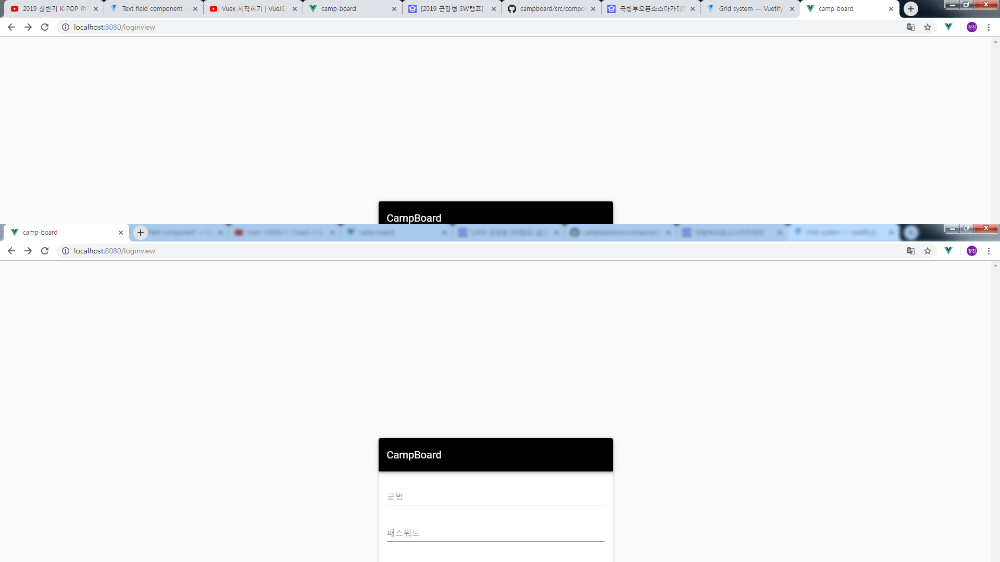
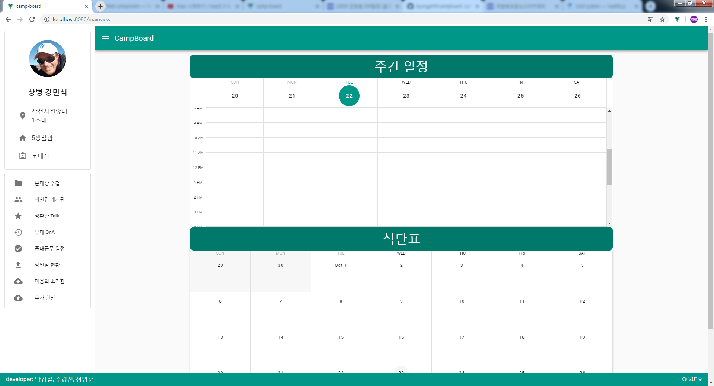
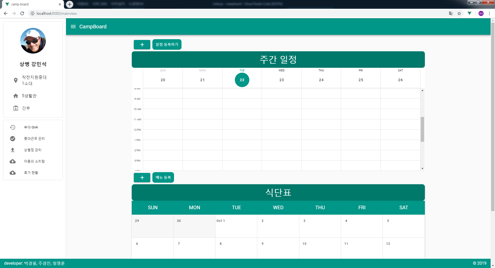
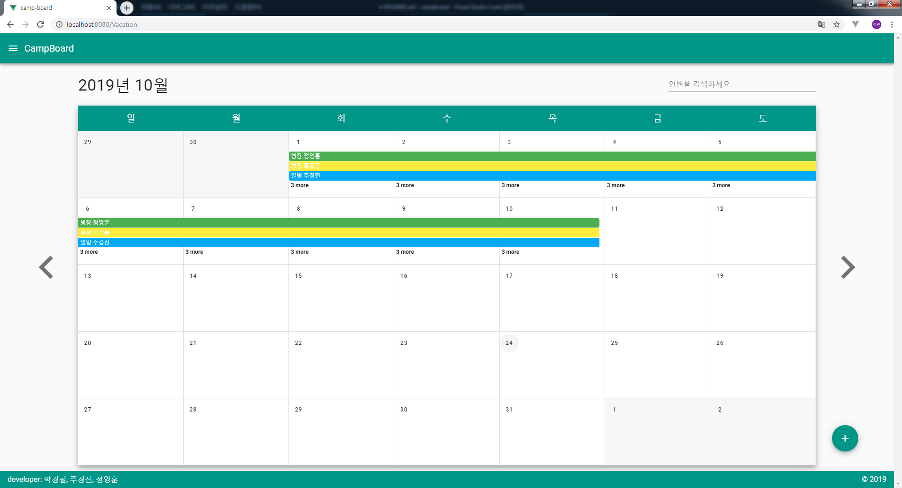
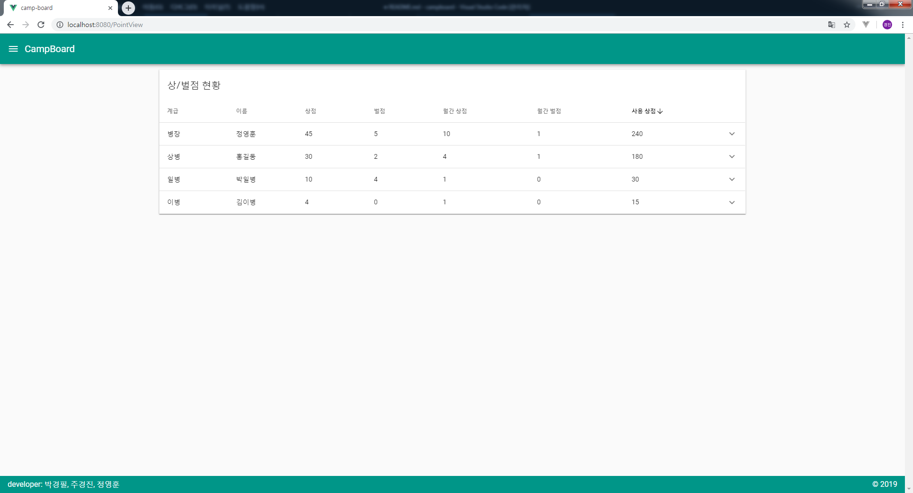

# camp-board

## Project setup

필요한 package는 json파일에 다있기 때문에 npm을 통해 프로그램 설치하면 끝.

```
npm install
```

## How-to-Use

- 사이트를 시작하면 **로그인**을 합니다.



- 아래의 스크린 샷은 **메인 메뉴**이고, 왼쪽 메뉴 표시를 띄우면 메뉴 바를 왼쪽에서 띄우고 옆에있는 **CampBoard를 클릭하면 메인 화면**으로 돌아갑니다.



- 단 **간부님으로 로그인 할때는 아래와 같이 일정과 식단표를 수정**할 수 있습니다. 수정하는 방법은 등록버튼은 등록이고 일정이나 식단을 클릭하면 삭제됩니다.



- 몇 가지 메뉴를 설명을 하면..



휴가 게시판은 인원을 검색하는 부분에 **계급**을 넣어도 검색이 됩니다!



상벌점 게시판은 계급이나 이름 즉, 위에 **카테고리를 눌러주면 정렬**을 다시 할 수 있습니다.

# Files

```
   +---components
   |   |   ToolBar.vue
   |   |
   |   +---class-board
   |   |       PostItem.vue
   |   |       PostList.vue
   |   |       PostNewItem.vue
   |   |
   |   +---heart-letter
   |   |       LetterNewItem.vue
   |   |       SendDialog.vue
   |   |
   |   +---layouts
   |   |       BasicLayout.vue
   |   |
   |   +---leader-note
   |   |       LeaderNote.vue
   |   |       LeaderNoteField.vue
   |   |       LeaderNoteItem.vue
   |   |       LeaderNoteList.vue
   |   |       SquadMateItem.vue
   |   |       SquadMateItemText.vue
   |   |       SquadMateList.vue
   |   |
   |   +---Login
   |   |       Regist.vue
   |   |       UserLogin.vue
   |   |
   |   +---mainShow
   |   |       AddFood.vue
   |   |       AddTodo.vue
   |   |       Calendar.vue
   |   |       FoodCalendar.vue
   |   |
   |   +---menus
   |   |       ExecutiveMenu.vue
   |   |       LeaderSoldierMenu.vue
   |   |       MenuList.vue
   |   |       SoldierMenu.vue
   |   |       UserProfile.vue
   |   |
   |   +---point-board
   |   |       PointTable.vue
   |   |
   |   +---question-board
   |   |       PostList.vue
   |   |       PostNewItem.vue
   |   |
   |   \---vacation
   |           VacationCalendar.vue
   |           VacationField.vue
   \---views
           ClassBoard.vue
           HeartLetter.vue
           LeaderNoteView.vue
           LoginView.vue
           MainView.vue
           PointView.vue
           QuestionBoard.vue
           QuestionView.vue
           VacationView.vue
```

# Developer

**박경필**
**주경진**
**정영훈**

# Issues

아직 **모바일 버전은 제대로 지원 안합니다.** 차후 수정해서 빠르게 지원 하겠습니다.

# version

### ver 1.0
